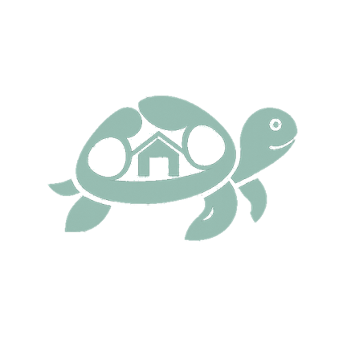
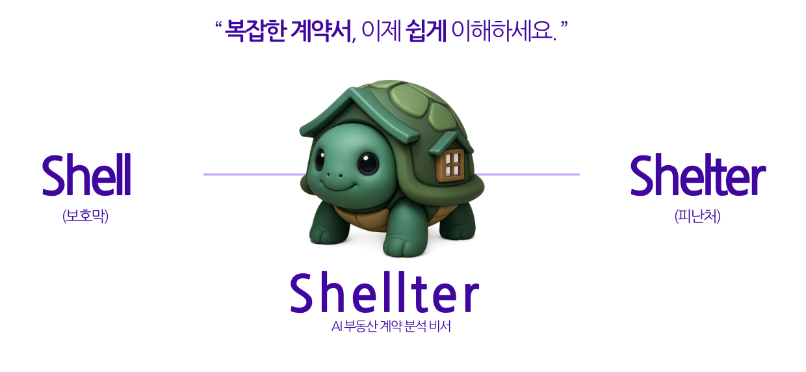
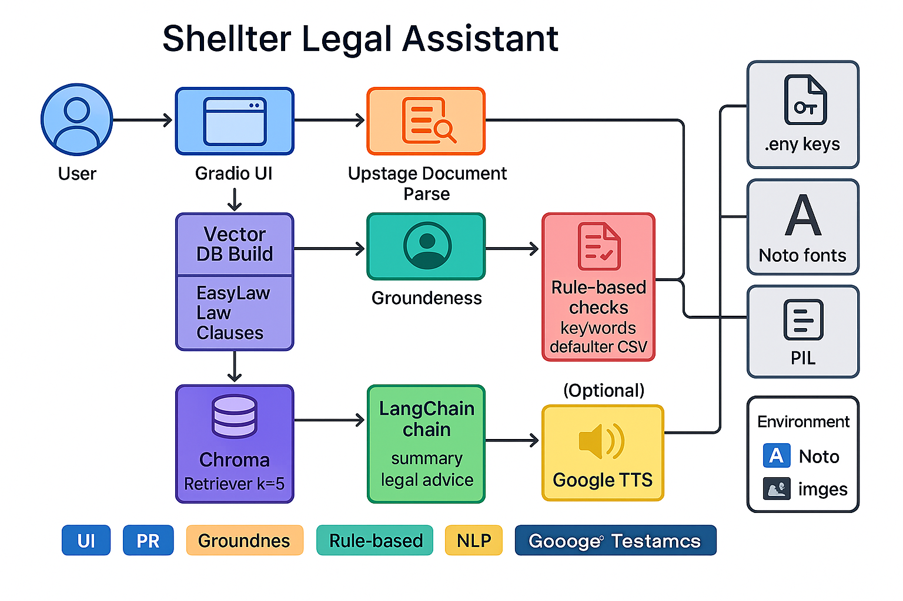
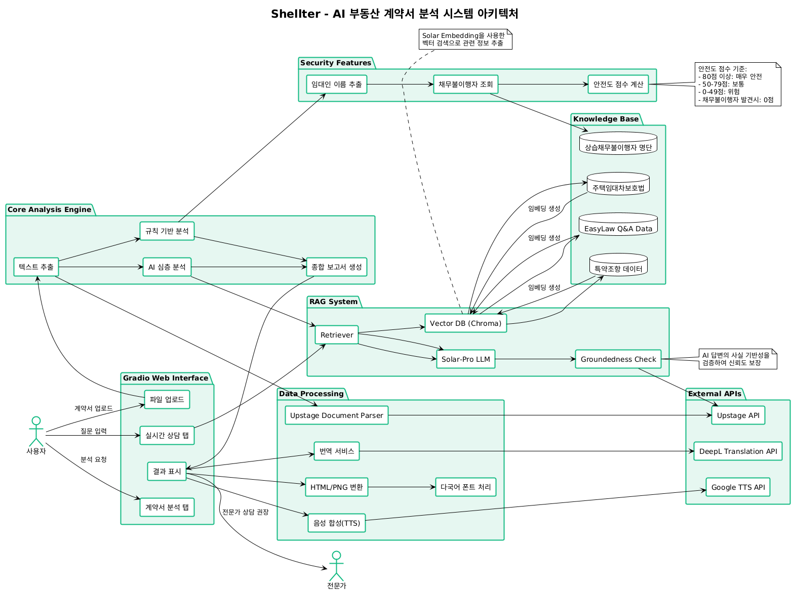

# Shellter

#### [ AI 부동산 법률 비서 ] 부동산 계약서의 숨은 위험을 찾아내고, 당신의 소중한 자산을 지켜드립니다.

  

> 부동산 계약서의 숨은 위험을 찾아내고, 당신의 소중한 자산을 지켜드립니다.🐢    
> AI 기반 부동산 계약서 분석과 실시간 법률 상담을 제공하는 똑똑한 법률 비서 🧑‍⚖️

  | [📖 **프로젝트 소개**](#-프로젝트-소개) | [✨ **주요 기능**](#-주요-기능) |
   [🔧 **설치 가이드**](#-설치-방법)   | [💡 **사용법**](#-사용법)                   |

  

  

## 📖 프로젝트 소개

### 개요

SHELLTER는 복잡한 부동산 계약서를 AI가 분석하여 임차인을 보호하는 스마트 법률 비서입니다.

전세사기, 불완전한 계약서, 숨겨진 독소 조항으로부터 당신을 보호합니다. 더 이상 어려운 법률 용어 때문에 고민하지 마세요.

### 프로젝트 비전

SHELLTER는 `모든 임차인이 안전한 주거를 찾을 수 있도록 돕는 AI 법률 플랫폼`이 되는 것을 목표로 합니다.

현재 PDF, 이미지, 워드 등 다양한 형태의 계약서를 분석하여 위험 요소를 찾아내고, 실시간 법률 상담을 제공합니다. 다국어 번역과 음성 출력으로 누구나 쉽게 이용할 수 있지만, 여기서 멈추지 않을 것입니다.

앞으로는 부동산 시장 데이터 분석, 지역별 임대료 통계, 임대인 신용도 평가까지 아우르는 종합 부동산 플랫폼으로 성장하여 임차인들이 안전하고 투명한 거래를 할 수 있는 생태계를 만들어갈 것입니다.

## ✨ 주요 기능

### 🔍 AI 기반 계약서 분석

  <video
    src="./video/paper.mp4"
    type="video/mp4"
    style="width:80%; height:auto; max-width:1280px;"
    autoplay
    muted
    playsinline
    loop
    controls
    preload="metadata">
    해당 브라우저는 video 태그를 지원하지 않습니다.
  </video>

다양한 형태의 계약서(PDF, 이미지, Word 등)를 업로드하면 AI가 자동으로 분석하여 위험 요소를 찾아냅니다. 규칙 기반 안전도 검사와 AI 심층 분석을 통해 종합적인 리포트를 제공합니다.

**주요 분석 항목:**
- 보증금 반환 조항 검토
- 권리관계 유지 조항 확인
- 수선 의무 및 특약사항 분석
- 임차인 불리 조항 탐지

> - #### 🌍 다국어 번역 지원
> DeepL API를 활용하여 분석 결과와 상담 내용을 6개 언어(한국어, 영어, 일본어, 중국어, 우크라이나어, 베트남어)로 번역 제공합니다. 외국인 임차인도 안전하게 계약할 수 있도록 지원합니다.

> - #### 🔊 음성 출력 기능
> Google TTS API를 통해 분석 결과와 상담 내용을 음성으로 들을 수 있습니다. 시각적 불편함이 있거나 이동 중에도 편리하게 정보를 확인할 수 있습니다.

> - #### 📸 리포트 저장 기능
> 분석 결과를 아름다운 PNG 이미지로 저장할 수 있습니다. 계약 당사자와 공유하거나 개인 기록용으로 활용하세요.

### 💬 실시간 AI 법률 상담

  <video
    src="./video/chat.mp4"
    type="video/mp4"
    style="width:80%; height:auto; max-width:1280px;"
    autoplay
    muted
    playsinline
    loop
    controls
    preload="metadata">
    해당 브라우저는 video 태그를 지원하지 않습니다.
  </video>

부동산 관련 궁금한 점을 언제든 AI 법률 전문가에게 물어보세요. 전세, 월세, 보증금, 계약 갱신 등 다양한 주제에 대해 신속하고 정확한 답변을 받을 수 있습니다.

  <video
    src="./video/chatTrans.mp4"
    type="video/mp4"
    style="width:80%; height:auto; max-width:1280px;"
    autoplay
    muted
    playsinline
    loop
    controls
    preload="metadata">
    해당 브라우저는 video 태그를 지원하지 않습니다.
  </video>

> - #### 🌍 다국어 번역 지원
> DeepL API를 활용하여 분석 결과와 상담 내용을 6개 언어(한국어, 영어, 일본어, 중국어, 우크라이나어, 베트남어)로 번역 제공합니다. 외국인 임차인도 안전하게 계약할 수 있도록 지원합니다.

> - #### 🔊 음성 출력 기능
> Google TTS API를 통해 분석 결과와 상담 내용을 음성으로 들을 수 있습니다. 시각적 불편함이 있거나 이동 중에도 편리하게 정보를 확인할 수 있습니다.

> - #### 📸 리포트 저장 기능
> 분석 결과를 아름다운 PNG 이미지로 저장할 수 있습니다. 계약 당사자와 공유하거나 개인 기록용으로 활용하세요.

## 🛠 기술 스택

## 🏗️ 시스템 아키텍처

## <a href="https://github.com/SheIIter/fullstack/blob/main/README.md">🚀 설치 방법<a>

## 💡 사용법

### 1. 계약서 분석

1. **파일 업로드**: PDF, 이미지, Word 파일 등 다양한 형태의 계약서를 업로드
2. **분석 시작**: "🔍 분석 시작" 버튼 클릭
3. **결과 확인**: 안전도 점수와 상세 분석 결과 확인
4. **추가 기능**: 번역, 음성 출력, PNG 저장 등 활용

### 2. AI 법률 상담

1. **실시간 상담** 탭으로 이동
2. 부동산 관련 질문 입력
3. AI 전문가의 즉시 답변 확인
4. 필요시 번역이나 음성으로 변환

### 3. 지원 파일 형식(OCR)

- **문서**: PDF, DOC, DOCX, HWP, TXT, MD
- **이미지**: JPG, JPEG, PNG
- **기타**: 텍스트 추출 가능한 모든 형태

## 🔧 API 키 없이 사용하기

API 키가 없어도 기본적인 기능을 체험할 수 있습니다:

- **샘플 텍스트**: Upstage API 없이도 샘플 계약서 텍스트로 분석 체험
- **규칙 기반 분석**: API 없이도 기본적인 안전도 검사 수행
- **기본 상담**: 미리 정의된 답변으로 상담 기능 체험

## 🎨 주요 특징

### 사용자 친화적 인터페이스
- 직관적인 웹 인터페이스
- 다크모드 자동 지원
- 반응형 디자인

### 포괄적인 분석
- 규칙 기반 + AI 기반 이중 분석
- 0~100점 안전도 점수 시스템
- 위험도별 색상 코딩 (🚨위험, ⚠️주의, ✅안전)

### 다양한 출력 형태
- 웹 HTML 리포트
- PNG 이미지 다운로드
- 다국어 번역 지원
- 음성 출력 (TTS)

## ⚠️ 주의사항

### 법적 고지

본 서비스는 **참고용 정보 제공만을 목적**으로 하며, 법적 효력이 없습니다. 중요한 계약 결정 전에는 반드시 변호사, 법무사 등 전문가와 상담받으시기 바랍니다.

### 개인정보 보호

- 업로드된 계약서는 분석 후 즉시 삭제됩니다
- 개인정보가 포함된 계약서는 마스킹 후 사용을 권장합니다
- 민감한 계약의 경우 로컬 환경에서 실행하세요

## 👥 팀 소개

<table>
  <tr>
    <td>UI/UX Designer & Data Researcher</td>
    <td></td>
    <td>
      
    </td>
    <td>
    Backend & API Developer</td>
    <td></td>
    <td>
      
    </td>
  </tr>

  <tr>
    <td>OCR & Document Specialist</td>
    <td></td>
    <td>
      
    </td>
    <td>Frontend Developer</td>
    <td></td>
    <td>
      
    </td>
  </tr>

  <tr>
    <td>QA & Content Strategist</td>
    <td></td>
    <td>
      
    </td>
    <td>Project Manager & RAG Architect</td>
    <td></td>
    <td>
      
    </td>
  </tr>

  <tr>
    <td>Business Analyst (Risk & Data)</td>
    <td></td>
    <td>
      
    </td>
    <td>Shellter(AI Chatbot)</td>
    <td></td>
    <td>
      
    </td>
  </tr>
</table>

## 📞 연락처

- **이슈 리포트**: [GitHub Issues](https://github.com/your-username/shellter/issues)
- **기능 제안**: [GitHub Discussions](https://github.com/your-username/shellter/discussions) 

## 🙏 감사의 말

SHELLTER는 다음 오픈소스 프로젝트들의 도움을 받아 개발되었습니다:

- [Gradio](https://gradio.app/) - 웹 인터페이스
- [LangChain](https://langchain.com/) - AI 체인 구성
- [Upstage](https://upstage.ai/) - 문서 파싱 및 LLM
- [DeepL](https://deepl.com/) - 번역 서비스
- [Google Cloud TTS](https://cloud.google.com/text-to-speech) - 음성 합성

---

  <strong>🐢 SHELLTER와 함께 안전한 부동산 거래를 시작하세요! 🧑‍⚖️</strong>

  

